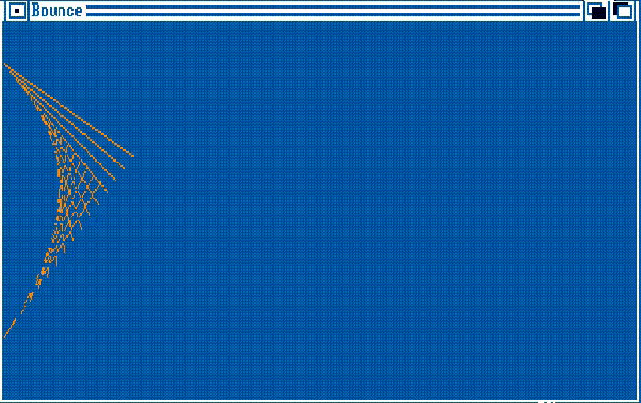

# AmigaDemos

This repository contains a series of small projects written in the C language for the Commodore Amiga platform.

## Compilation

These demos are compiled using a single `Makefile` located in the root directory of this repository.

### Prerequisites

Ensure you have `amiga-gcc` installed and correctly configured on your development system (the `bin` directory with all *amiga-gcc* binaries should be in your system PATH). You can follow the installation instructions found in the [bebbo/amiga-gcc](https://github.com/bebbo/amiga-gcc) repository.

### Compilation Instructions

To compile all the demos in this repository, navigate to the root directory in your terminal and run the `make` command. This command will compile all the individual demo projects defined in the `Makefile` and generate their respective Amiga executables. The executables will be created in `build` directory, as specified in the `Makefile`. Once compiled, the executables can be transferred to a real or emulated Amiga system (such as [WinUAE](https://www.winuae.net/)) for execution.

## Contents

This repository currently includes the following demos:

  * **hello:** The classic "Hello, World!" demo
  * **helloamiga:** Another "Hello, World!" but with AmigaDos API
  * **helloconsole:** Create a new console windows
  * **hellointuition:** Open a new window with "Intuition" API
  * **bounce**: Some bouncing lines

## Compatibility with old Amiga C compiler

All source file of this project aim to be compatibile with old Amiga C compiler. To achive this goal the C language use the following convention:

* All comments use the multi-line comment style (`/* ... */`). (Double slashes `//` were introduced later.)
* Function arguments are declared outside the function prototype.
* Variables are declared at the top of any function.

## License

MIT License

## Acknowledgements

Special thanks to [Stefan "Bebbo" Franke](https://github.com/bebbo) for creating and maintaining `amiga-gcc`.
